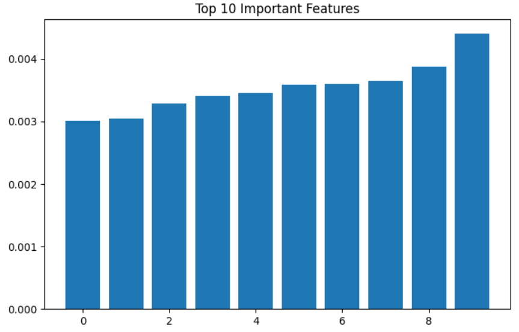

# ✋ Hand Gesture Recognition using Machine Learning

## 📌 Overview

This project is a Hand Gesture Recognition System. 

The model is trained on the **LeapGestRecog Dataset** to recognize different hand gestures from images using Machine Learning techniques.

---

## 🎯 Objectives

* Load and preprocess gesture images.
* Extract useful image features.
* Train a machine learning model for gesture classification.
* Evaluate model performance.
* Predict gestures from new images.

---

## 📂 Dataset

**Dataset:** LeapGestRecog

The dataset contains thousands of hand gesture images belonging to multiple gesture classes such as:

* Palm
* L
* Fist
* Fist Moved
* Thumb
* Index
* OK
* Palm Moved
* C
* Down

---

## ⚙️ Technologies Used

* Python
* OpenCV
* NumPy
* Pandas
* Matplotlib
* Scikit-learn
* Jupyter Notebook

---

## 🔄 Machine Learning Pipeline

### 1. Data Loading

Gesture images were loaded from the LeapGestRecog dataset.

### 2. Data Preprocessing

* Converted images to grayscale
* Resized images to 64 × 64 pixels
* Normalized pixel values

### 3. Data Visualization

Gesture distribution was visualized to understand dataset balance.

### 4. Feature Extraction

Images were flattened into feature vectors suitable for machine learning algorithms.

### 5. Label Encoding

Gesture labels were converted into numerical values.

### 6. Train-Test Split

The dataset was divided into training and testing sets.

### 7. Model Training

A Random Forest Classifier was trained on the processed dataset.

### 8. Model Evaluation

Performance was evaluated using:

* Accuracy Score
* Classification Report
* Cross Validation

### 9. Prediction

The trained model predicts hand gestures from unseen images and provides confidence scores.

---

## 📊 Results

* Successfully trained a Hand Gesture Recognition model.
* Achieved excellent classification performance on the LeapGestRecog dataset.
* Performed cross-validation for reliable evaluation.
* Generated predictions with confidence scores.

---

## 📸 Project Screenshots

### Gesture Distribution

### Prediction Output

### Feature Importance

---

## 🚀 Future Improvements

* Deep Learning using CNN
* Real-time Webcam Gesture Recognition
* Streamlit Web Application
* Mobile Deployment

---

## 👨‍💻 Author

Hanish Kumar

This project is developed for educational and internship purposes.
